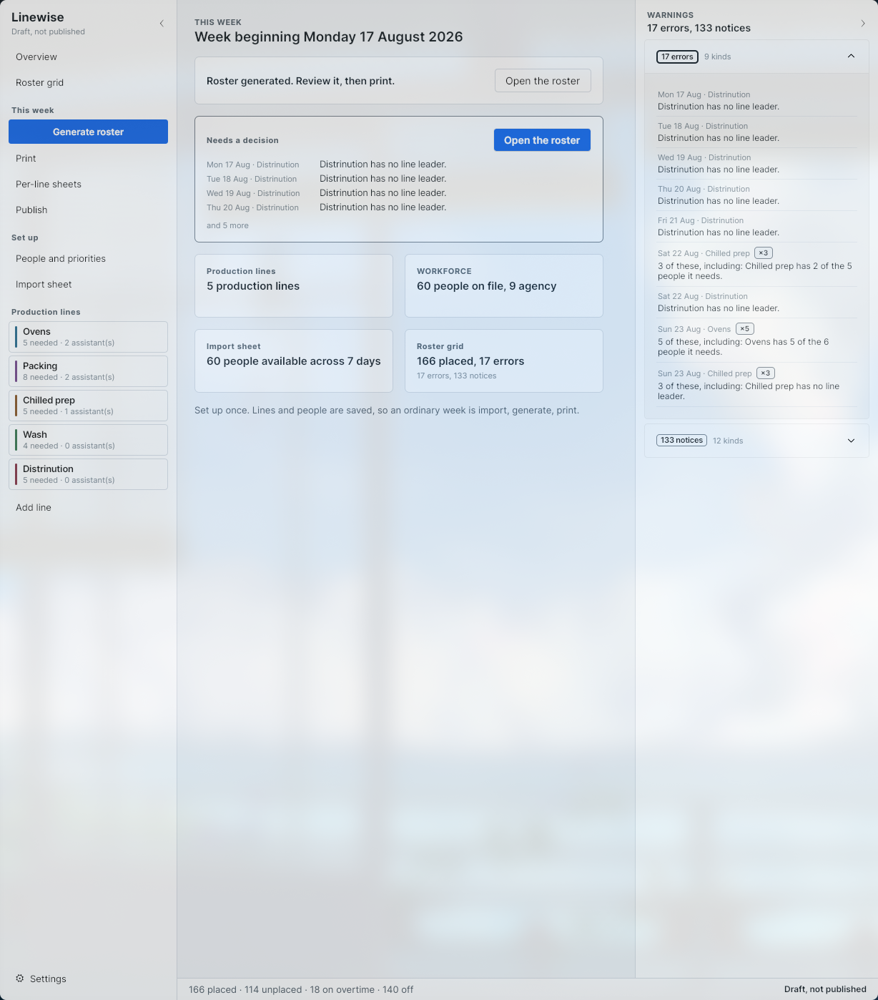

# Linewise

[](https://github.com/socom1/LineWise/actions/workflows/ci.yml)


Production line rostering for food manufacturing. Windows desktop, .NET 8, Avalonia.



## Why

I work in food manufacturing. Every week I watched the same thing: a production manager
building the line roster by hand from a colour coded spreadsheet, deciding who works which
line and who leads it, honouring a set of rules that exist nowhere except in their head.
Print it, stick it on the wall, done — until somebody rings in sick on Monday and it is done
again.

It costs hours a week. The rules leave with the person who holds them. And the sick call is
the expensive part, because it is never one change: taking somebody off Ovens means finding
cover who is in, who is allowed on that line, and who is not already standing somewhere else.

Linewise reads the same spreadsheet, produces the roster, and explains every placement. It
does not try to be cleverer than the manager — it does the arithmetic and leaves the
judgement.

Knowing the floor is why the awkward parts are in here at all: agency workers who turn up
unannounced and must be addable mid-import, a sheet that changed format halfway through
being built against, printers that are monochrome more often than not, and the fact that the
person reading the roster is doing it from four feet away while walking past.

## Status

Phase 6 of eight. Not released, and not yet used by anybody.

1.0.0 is reserved for the first build that has produced a roster somebody actually worked
to. See [Known limitations](#known-limitations).

## Build and test

```
dotnet test
dotnet run --project src/Linewise.Desktop
```

`dotnet test --filter Category!=Integration` for the fast loop.

## How it decides

Ten rules in a fixed order: locked placements, availability, mandatory preferences, leader
selection, overtime routed to the busy lines, ranked preferences across the whole workforce
at once, the fairness tie break, the absolute skill and blocked filter, backfill, then
warnings.

Greedy, not optimal. A constraint solver would find better rosters and produce answers nobody
can explain, and the first question about any generated roster is why it did what it did.
Every placement records which rule made it and at what preference rank.
[ADR 0001](docs/adr/0001-greedy-assignment-over-a-constraint-solver.md).

The engine is pure: no I/O, no logging, no static state, and identical inputs always produce
an identical week.

## If you are reviewing this

The code is ordinary. The decisions are the interesting part, and they are written down.

- [ADR 0009](docs/adr/0009-overtime-follows-demand-rather-than-preference.md) — a rule that
  was correct on paper and would almost never have fired, caught before it shipped.
- [ADR 0014](docs/adr/0014-availability-records-say-who-set-them.md) — marking somebody absent
  turned out to be a change to two records, and a re-import would have silently undone it.
- [ADR 0010](docs/adr/0010-the-printed-sheet-carries-no-meaning-in-colour.md) — nothing on the
  printed sheet is distinguished by colour alone. Monochrome printers, photocopiers, and the
  eight percent of men with a colour vision deficiency reading a sheet whose source
  spreadsheet already uses red and green.
- [ADR 0013](docs/adr/0013-the-application-ships-its-own-typeface.md) — reverses an earlier
  rule in the design document, and says which part of it survived.
- [docs/data-protection.md](docs/data-protection.md) — no reason for an absence is stored
  beyond the status. "Holiday" is recorded, "hospital appointment" is not.

Four defects on this project were invisible to a green test suite and only appeared by
running the application: an uninitialised database, a week with no shifts, a main window
whose every command was silently a no-op, and a screen that could not be saved twice. Two of
them now have tests that would have caught them. The commit messages say what was rejected
and why, which is usually the part worth reading.

## Design

Seventeen numbered decisions in [docs/adr](docs/adr/), including the ones later reversed.
[Architecture](docs/architecture.md) explains the layering and why `Linewise.Domain` contains
no `PackageReference` at all. [Technical design](docs/technical-design.md) is the plan;
[threat model](docs/threat-model.md) and [data protection](docs/data-protection.md) are living
documents rather than sections of it.

## Known limitations

- **Never used in a factory.** Every rule the engine encodes is an assumption that happens to
  compile.
- **The historic replay has not been done.** Replaying a real month against the engine and
  comparing it to what the manager actually produced is the highest value testing left, and it
  needs data nobody has sent yet.
- **No installer.** Runs from `dotnet run`. Packaging is phase 8.
- **Windows is the target; Linux is where it is developed.** The suite passes on both and the
  application runs on both, but the database key is weaker on Linux by design.
  [ADR 0011](docs/adr/0011-development-happens-on-linux-and-shipping-does-not.md).
- **Import detection was built against invented spreadsheets.** It finds the shapes somebody
  thought to invent. A sheet nobody imagined still needs a template by hand.
  [ADR 0017](docs/adr/0017-the-importer-reads-the-sheet-before-it-reads-the-template.md).
- **No undo.** Every editing action is one way.
- **Backup runs on startup and cannot be restored from the application.** The service and the
  restore routine are tested; neither has a button.

## Licence

All rights reserved. See [LICENSE](LICENSE). Not open source, and not accepting
contributions.

No real employee data appears anywhere in this repository, including screenshots and test
fixtures. The client is not named.

Built by Rejus Zuzevicius.
